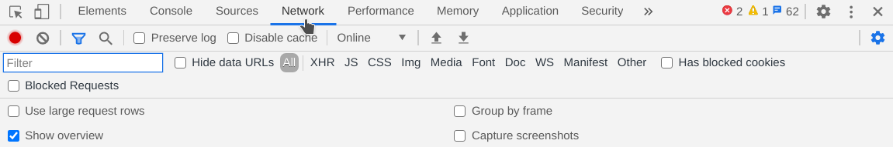
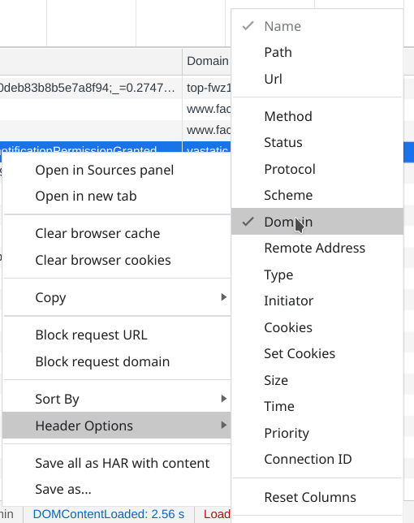
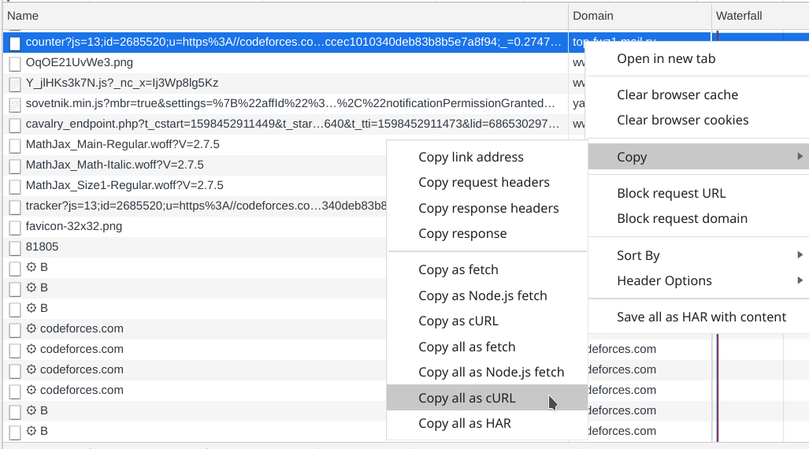
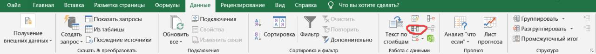

### Solution:
1. Открываем Google Chrome и переходим в режим инкогнито
2. Переходим на сайт [https://codeforces.com/](https://codeforces.com/).
3. Окрываем веб-инспектор браузера Google Chrome (`Ctrl + Shift + I`).
4. Переходим во вкладку `Network`:



5. Правой кнопкой мыши по любому реквесту `-> Header Options` и оставить только  `Domain`:



6. Правой кнопкой мыши по любому реквесту `-> Copy -> Copy all as cURL`:



7. На скаченом [файле](./source/curls.txt) используем регулярные выражения в Sublime Text 3.0:
```
(http|ftp|https)://([\w_-]+(?:(?:\.[\w_-]+)+))([\w.,@?^=%&:/~+#-]*[\w@?^=%&/~+#-])?
([\w_-]+(?:(?:\.[\w_-]+)+))([\w.,@?^=%&:/~+#-]*[\w@?^=%&/~+#-])?
/(.+)
```
8. Убрав ненужное, получаем [файл](./source/parse2.txt);
9. Удалим дубликаты при помощи `Excel`:



10. Получаем ответ: 
``` 
codeforces.com
sta.codeforces.com
fonts.googleapis.com
assets.codeforces.com
vk.com
st.codeforces.com
i.imgflip.com
www.googletagmanager.com
connect.facebook.net
ssl.google-analytics.com
fonts.gstatic.com
www.youtube.com
top-fwz1.mail.ru
googleads.g.doubleclick.net
www.google.com
static.doubleclick.net
staticxx.facebook.com
www.facebook.com
i.ytimg.com
yt3.ggpht.com
z-p3-static.xx.fbcdn.net
```
